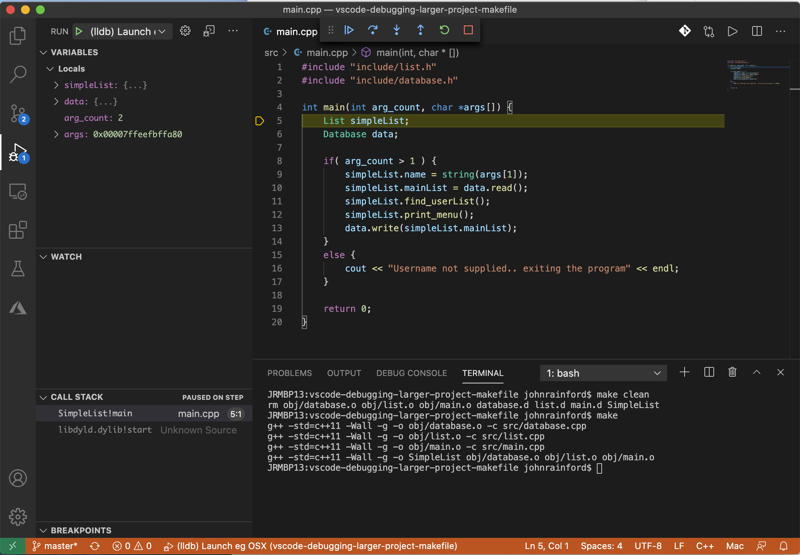

# SimpleList
Simple List is a beginner C++ program to keep track of a list of items.

Demonstrates VSCode debugging when built with makefile

```
$ make clean
$ make
```

Run with 

## Forked from:-

https://github.com/SavvyNik/SimpleList

https://www.youtube.com/watch?v=9VpiGwp8Vos&t=188s

## simple debugging in VSCode of C++ using debug button (bug on triangle) on left


## "externalConsole": true
in launch.json to allow cin to work (fires up a real terminal window)

## "stopAtEntry": true
useful too to stop at beginning of main




See also 
https://www.youtube.com/watch?v=X2tM21nmzfk
